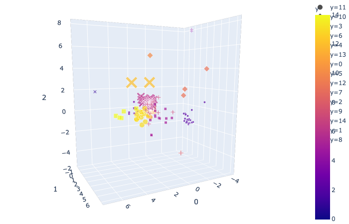
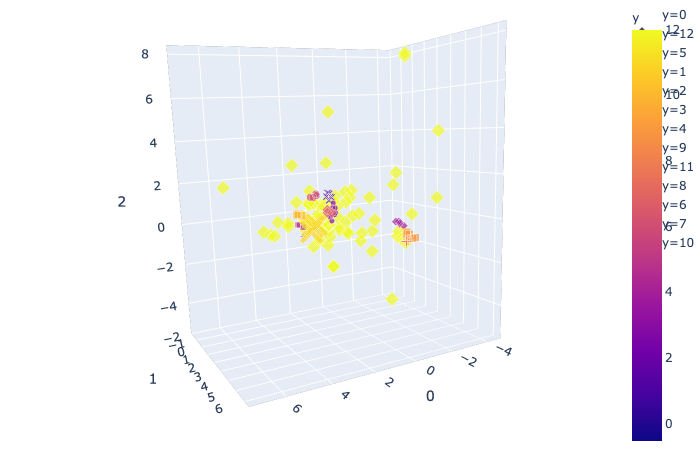

# Fuel Additives Analysis
The aim of this analysis was to determine the distinctive number of fuel formulations present in the dataset.

A descriptive & distribution analysis of the dataset conducted in ***Analysis.ipynb***

Clustering tests were conducted in ***Clustering.ipynb***

### Methodology
1. The dataset was standardize
2. The dataset was projected into a lower dimension via PCA
3. Elbow method was conducted to find optimum value of K
4. K-mean clustering was conducted
5. DBSCAN clustering was conducted

### Conclusion
The clustering algorithms have inferred 13 to 15 unique clusters respectively. Hence, there may be approximately 13 to 15 distinctive number of formulations present in the dataset.

###K-means clustering### 15 distinctive formulations

###DBSCAN Clustering### 13 distinctive formulations

### Environment Setup
1. Initialize a cloud instance with Linux Ubuntu OS & 4gb of RAM
2. SSH into cloud instance via terminal with key pair authorization
3. apt-get install Docker
4. Run & Start Jupyter's docker image
5. Access Jupyter notebook via browser http://hostname:8888/
